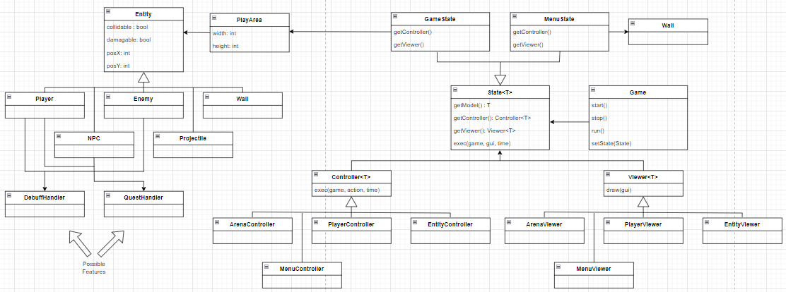

## LDTS_07_07 - Fallen World

In Fallen World, you can help your character survive the zombie apocalypse by fighting all the zombies that 
come your way. You can also collect power-ups or other guns, that will help you survive for as long as you can.

This project was developed by *José Nuno Quintas (up202108712@up.pt)* for LDTS 2023/2024

### IMPLEMENTED FEATURES

- **User Input** - The program correctly interprets the keys pressed by the user. This is used for the player controls.
- **Arena Building** - The program can correctly build the arena, rendering the player, walls and enemies. Enemies will also spawn at random with their spawn rate increasing as the player gets a higher score.
- **Player Movement** - The player can move around the arena, avoiding enemies and walls, as well as picking up powerups and weapons.
- **Player Shooting** - The player can shoot a limited number bullets, which damage enemies or destroy them if they suffer enough damage. A reload system has also been implemented, which will prevent the player from shooting if they have no bullets left and forcing them to reload.
- **Enemy Movement** - The enemies can move randomly around the arena but will detect the player in their vicinity. From here, they will try to get closer to the player, damaging them when in contact.
- **Power-Ups** - The player is able to collect power-ups, which will give them a permanent advantage over the enemies. These come in three types: Health Regeneration (Resets the player's health to the max), Health Boost (Increases player's max health) and Speed Boost (Increases the player's speed).
- **Score System** - The player can see and store their score at the end of the game. This is calculated based on the number of enemies killed.
- **Weapons** - The player can pick up weapons, which will replace their current weapon. Different weapons have different ammo capacities, maximum number of projectiles and damage. The player can pick up one of three weapons: Assault Rifle, Machine Gun and Rocket Launcher. Each weapon spawns on the arena at a certain value of the player's score.

### PLANNED FEATURES

- **NPCs and Quests** - The player will be able to interact with NPCs, which will give them quests that, if concluded, will give rewards to the player.

- **Debuffs** - The player will be able to suffer or inflict debuffs on the enemies. Debuffs will give the inflicted entity a temporary or permanent disadvantage over the enemies. Debuffs can also damage the inflicted entity over time.

### DESIGN

You can find the UML diagram for the project, detailing all classes organizations and interactions in the image below:

### KNOWN CODE SMELLS

- Some classes and methods are large, indicating complexity and maintainability issues.
- There is some duplicate code, which could hinder maintenance efforts and performance.
- Some Methods have long parameter lists, increasing their complexity.
- There is some feature envy, where methods from a class rely on data from other classes.
- There are some Data clumps, indicating the need for better data encapsulation.
- Some comments have been left in the code, but most are there to better help understand each method's functionalities and responsabilites.

### TESTING

- The project includes unit tests, as evidenced by the test result files and reports.

### SELF-EVALUATION

- José Nuno Quintas: 100%
